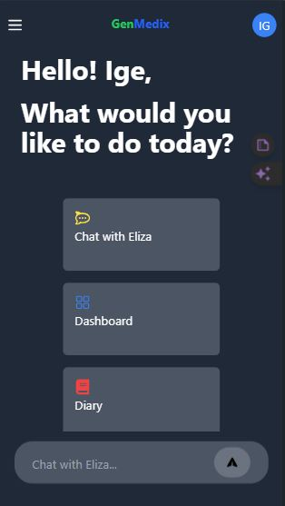

# GenMedix Project

### By Team DevTitans
[Live Site](https://genmedix.vercel.app)


## Introduction
GenMedix is a mental health AI software designed to help users improve and recover their mental health through automated therapeutic intervention, perfomance tracking and personalised recommendations.

## Features
- AI Assistant Chatbot (Eliza) for mental health conversations.
- Performance tracking
- Access to a wide range of mental health resources such as daily news
- User-friendly interface.
- Secure and confidential.

## Tools
- Programming Languages: Python (Backend), JavaScript
(Frontend)
- Libraries and Frameworks: React js, FastAPI,

This repository contains both frontend and backend components for the GenMedix project. Each folder (`frontend` and `backend`) includes its own README file with specific instructions on installation and running procedures.

## Installation

1. Clone the repository:
    ```bash
    git clone https://github.com/Defdave/GenMedix.git
    ```
2. Navigate to the project directory:
    ```bash
    cd GenMedix
    ```

## Frontend

For detailed instructions on how to install and run the frontend application, please refer to the `genmedix-frontend` directory.

You can view the live site [here](https://genmedix.vercel.app).

## Backend

For detailed instructions on how to install and run the backend API server, please refer to the `genmedix-backend` directory.
Note: The backend requires an API key for functionality. Instructions for obtaining the API key are in the backend's README file.

## Desktop View


## Mobile View



## Contact

For any questions or feedback regarding the GenMedix project, please contact us at:

- igedavid01@gmail.com
- samuelajala01@gmail.com

### Team DevTitans

- [David Ige](https://github.com/defdave)
- [Samuel Ajala](https://github.com/samuelajala01)


